<picture>
  <source media="(prefers-color-scheme: dark)" srcset="./assets/banner-dark.svg">
  <source media="(prefers-color-scheme: light)" srcset="./assets/banner-light.svg">
  
</picture>

  

 

## Sobre

Desenvolvedor com foco em **backend e plataforma**. Passo a maior parte do tempo em API, modelagem de dados e no que roda por baixo: containers, deploy, backup e observabilidade.

O tipo de problema que mais me interessa é integração. Puxar dado de ERP legado sem expor o banco do cliente na internet, sincronizar app de campo que trabalha offline, colocar uma camada de IA em cima de sistema que nasceu em 2004 e continua rodando. Trabalho principalmente com **TypeScript** e **C# / .NET**, com **Go** onde precisa de binário único rodando na infra do cliente.

Boa parte do que construo é produto de empresa e mora em repositório privado, então a lista abaixo descreve os projetos em vez de linkar código.

 

## Stack

**Backend**

**Front e mobile**

**Dados**

**Infra**

 

## Projetos

### Orion

Plataforma multi-tenant que conecta o ERP do cliente a uma camada de IA conversacional.

A API central cuida de autenticação, gestão de tenants, orquestração de IA com tool calls, integração com WhatsApp e trilha de auditoria. Do outro lado tem um conector escrito em Go que roda dentro da infra do cliente. Ele executa apenas consultas definidas previamente (nunca SQL arbitrário), normaliza o resultado e manda para a API por conexão de saída, com heartbeat e fila de tasks. O banco do ERP nunca precisa ficar exposto para a internet e o cliente não abre porta nenhuma.

`Bun` · `Hono` · `Go` · `PostgreSQL` · `Redis` · `S3`

### AuditStock

Produto de auditoria e conferência de estoque físico para inventários.

Painel web em React 19 com TanStack Router e Query, Tailwind 4 e shadcn/ui, entregue como SPA estática em subpath com deploy scriptado. A API roda em C# / .NET sobre SQL Server e existe um app de coleta que acompanha o operador em campo. O produto atende um setor que trabalha com inventário desde 2004, então boa parte do desafio é caber em processo que já existe.

`React 19` · `TypeScript` · `C# / .NET` · `TanStack` · `Tailwind` · `Docker`

### QuickCount

Plataforma de contagem de inventário com app mobile e painel web.

O app em React Native com Expo faz leitura de código de barras e precisa funcionar em galpão sem sinal, então a operação é offline primeiro e sincroniza depois. O painel é React com Radix UI e Redux Toolkit, e o backend está dividido entre TypeScript e C# sobre SQL Server.

`React Native` · `Expo` · `TypeScript` · `C# / .NET` · `SQL Server`

### BetterAging

API de produto construída do zero em Bun com Hono.

Autenticação com Lucia e OAuth via Arctic, Prisma sobre PostgreSQL, busca vetorial em Qdrant para recuperação de contexto, integração com OpenAI, cobrança no Stripe, arquivos em S3, push com OneSignal e métricas expostas para Prometheus. É o projeto onde mais mexi com camada de IA em produção de verdade, com custo e latência importando.

`Bun` · `Hono` · `Prisma` · `PostgreSQL` · `Qdrant` · `Stripe` · `Prometheus`

### Quick Logger

Serviço de log centralizado para os apps que mantenho.

A API recebe eventos autenticados por API key, guarda em MongoDB e libera consulta com JWT. O painel é React com TanStack Router e Table. Nasceu de uma dor real: parar de depender de print de tela do cliente para entender o que quebrou em produção.

`Bun` · `TypeScript` · `MongoDB` · `JWT` · `React`

 

## Atividade

  

<picture>
  <source media="(prefers-color-scheme: dark)" srcset="https://raw.githubusercontent.com/vitorsoarescosta344/vitorsoarescosta344/output/github-snake-dark.svg">
  <source media="(prefers-color-scheme: light)" srcset="https://raw.githubusercontent.com/vitorsoarescosta344/vitorsoarescosta344/output/github-snake.svg">
  
</picture>

 

  Aberto a conversa sobre backend, integração de sistema legado e infraestrutura.

